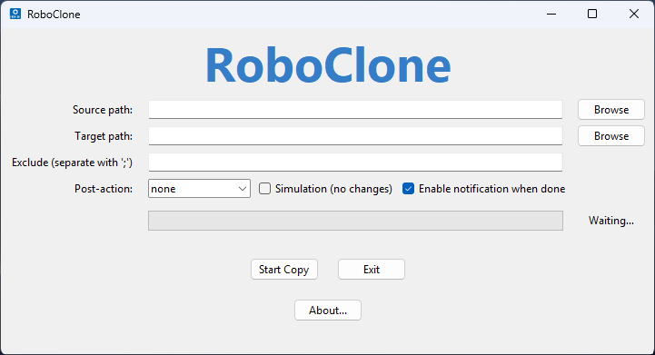

# RoboClone

RoboClone is a lightweight Python GUI that wraps **Robocopy** (Windows) to perform quick, automated, and verifiable backups.



## Features
- Browse–select source and target folders
- Dry‑run mode (`/L`) to preview changes
- Exclusion list for files / directories
- Free‑space pre‑check to avoid failed copies
- Progress bar based on Robocopy log
- Tray notification on completion
- Post‑action: **none / close app / reboot / shutdown** with 5‑second cancel window
- Portable ‑ no installer required (just Python 3.9+)

## Future Functions Roadmap
This document outlines the **planned features** that will be introduced in upcoming releases.  
They are currently *under active development* and **not yet available** in the stable build.

| Feature | Description | Target Milestone |
|---------|-------------|------------------|
| **Action History** | Persistent log of all operations (backups, restores, imports, exports) with time stamps, status, and user metadata; includes search and filter tools plus CSV export. | v2.0 |
| **Config Import / Export** | One‑click *Import* and *Export* of application settings, schedules, and history to `.ini` archives, simplifying migration between machines and CI pipelines. | v2.1 |
| **Command‑to‑BAT Export** | Save any interactive command sequence to an auto‑generated `.bat` file, enabling one‑click re‑execution or Windows Task Scheduler integration. | v2.2 |
| **Scheduled Backup** | Allow users to define automated backup jobs on a daily, weekly, or custom schedule. Supports local and network destinations, compression, and email notifications on success/failure. | v2.3 |

## High‑Level Goals

1. **Reliability first** – all new functions will ship with transactional safety checks and rollback paths.  
2. **Zero‑touch automation** – default settings aim to work out‑of‑the‑box; advanced users can fine‑tune via the UI or CLI.  
3. **Transparency & auditability** – every automated task leaves a traceable record in the Action History.

## How to Run

To start the software, use the following command:
```
python roboclone.py
```
Alternatively, you can download a pre-compiled `.exe` version from the [Releases](https://github.com/damiandrake0/RoboClone/releases) section of the GitHub repository for immediate use.

### Requirements
```bash
pip install pillow plyer
```

## Usage

1. Select Source and Target folders.
2. Optionally, add exclusions (separated by semicolons), enable dry-run, or change the post-action.
3. Click "Start Copy."

Logs will be saved to `logs/robocopy_log_<timestamp>.txt`.

## Contributing & Development

- The code is fully commented for clarity.
- The GUI is built with `tkinter` / `ttk` and kept in a single file for portability.
- Contributions are welcome! Please open an issue or a pull request (PR).

## License

GNU GPL v3 License

Enjoy :)

---

*Last updated: 2025‑04‑24*
